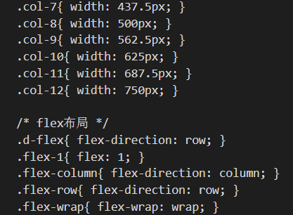

# 原子化css引擎Unocss上手指南

## 🥇前言

以前写移动端项目时，每次写css总感觉说不出来的麻烦。一次偶然机会在预定义变量的时候，在想：我能不能把一些常用的css也预定义好，这样用的时候就可以直接简写。读起来方便，写起来高效。然后就自己预定义了一份common-base.css文件，存放一些常用的css样式。大概长这个样子：



使用的时候这样：

```js
<!-- 搜索框 -->
<view class="ml-2 flex align-center flex-1 rounded-2 px-1" style="background-color: #F6F7F8;color: #959FA0;" @click="goSearch()">
  <text class="iconfont iconsousuokuang" style="margin-right: 8px;font-size: 20px;"></text>
  <text>点击搜索框跳转专属搜索页面</text>
</view>
```

效率是提升了不少，配合一个common-theme主题色文件，适用于大部分移动端项目(其实可以适用全部的)。于是乎，后面我的很多移动端项目都是直接复制这2个文件+初始化修改，就开始写了。

本着关注技术动态和不自己瞎造轮子的原则，接触到了原子化css的概念，原来名字可以这么高大上。

可能是经常用类似的东西，上手很快。简单的理解：**所有常用的css样式可直接简写，一些不大常用的，也可兼容**，当然，这只是为了方便你快速上手的一句话，下面正式介绍下这个小伙伴：**原子化css引擎**-Unocss

😘 介绍3步走：好处与问题，用法，注意事项

首先市面上的原子化css引擎特别多， [Tailwind CSS](https://tailwindcss.com/)，[Windi CSS](https://cn.windicss.org/) 以及 [Tachyons](https://tachyons.io/) 等，同时有些 UI 库也会附带一些 CSS 工具类作为框架的补充，如 [Bootstrap](https://getbootstrap.com/docs/5.1/utilities/api/) 和 [Chakra UI](https://chakra-ui.com/docs/features/style-props)等。具体的原子化css介绍，可以点这里看一看大佬的文章  [重新构想原子化](https://antfu.me/posts/reimagine-atomic-css-zh) ，写的很赞！

##  🥈优缺点

### 🎉好处：

我简单总结下使用后的体验吧：小而美

- 提高开发效率：开发时不用html-css来回切换
- 维护方便：不用维护删除废弃的样式，只构建使用到的类，随便用。更改时也不用有什么负担，不会影响到其他地方。
- 降低负担：不用去想各种class名字，也不用管来回的嵌套，简写很方便
- 统一标准规范，便于多人协作：大家用的都是一个东西，看一眼名字就知道是啥，不会因为一些奇怪的写法或用法再去沟通。
- 复用性强：正如上面举例的场景，随用随走，且项目越大好处越明显。

### 🧨 缺陷：

东西总有2面性，知道缺点才能更好的接受

- 记忆负担：对css不熟悉或首次使用的时候，需要一个适应过渡期。长短快慢，因人而异，大部分都是1个项目结束，就可以完美驾驭。unocss 也提供了2个工具，协助我们高效开发：
  - 1. Vscode插件搜索Unocss 
  - 2. 原子化css的unocss查询网址https://unocss.dev/interactive/?s=z-index，直接在这里输入想用的class

- 一些老项目或参考项目提供的css或less文件无法直接使用

- 样式过多带来的负担：如果一个标签要使用大量的css样式，会增加template里的阅读难度。

  ```html
  <div class="bg-#ff9981 text-white p-10rpx mx-20rpx mt-9rpx pos-absolute top-10">世界和平</div>
  ```

- 优化方法：apply提取这个提取的类是能够达到复用
  ```html
  <div class="world-peace">世界和平</div>
  <style>.world-peace{
      @apply bg-#ff9981 text-white p-10rpx mx-20rpx mt-9rpx pos-absolute top-10
  }</style>
  ```

  

## 🥉项目上手用法

- 下面以vite项目中使用为例：一键框架生成器的用例
- 更多项目集成方法：https://alfred-skyblue.github.io/unocss-docs-cn/integrations/

### 1. 准备工作

#### 1.1 安装unocss包

```bash
npm install -D unocss
```


#### 1.2 项目中配置按需使用

- 创建`./uno.config.ts`文件

  ```js
  // uno.config.ts
  import { defineConfig } from 'unocss'
  import presetIcons from '@unocss/preset-icons'
  import presetUno from '@unocss/preset-uno'
  
  export default defineConfig({
    presets: [
      presetUno(),
      presetIcons({
        collections: {
          //把自己的svg文件转换为class，这里的my-icon名称随便取，使用的时候通过i-my-icon-[filename]。
          // 'my-icon': FileSystemIconLoader(
          //    './src/assets/svg',
          //     svg => svg.replace(/#FFF/, 'currentColor'),
          // ),
          // carbon: () => import('@iconify-json/carbon/icons.json').then(i => i.default),
          // mdi: () => import('@iconify-json/mdi/icons.json').then((i) => i.default)
          // logos: () => import('@iconify-json/logos/icons.json').then(i => i.default),
          tabler: () => import('@iconify-json/tabler/icons.json').then((i) => i.default)
        },
        scale: 1.2,
        warn: true
      })
    ]
  })
  
  ```

- 在`vite。config.ts`文件配置

  ```js
  import { fileURLToPath, URL } from 'node:url'
  import UnoCSS from 'unocss/vite'
  
  import { defineConfig } from 'vite'
  import vue from '@vitejs/plugin-vue'
  import vueJsx from '@vitejs/plugin-vue-jsx'
  import AutoImport from 'unplugin-auto-import/vite'
  import Components from 'unplugin-vue-components/vite'
  import { ElementPlusResolver } from 'unplugin-vue-components/resolvers'
  import { createSvgIconsPlugin } from 'vite-plugin-svg-icons'
  import path from 'path'
  
  // https://vitejs.dev/config/
  export default defineConfig({
    plugins: [
      vue(),
      vueJsx(),
      UnoCSS(),
      AutoImport({
        resolvers: [ElementPlusResolver()]
      }),
      Components({
        resolvers: [ElementPlusResolver()]
      }),
      // * 使用 svg 图标
      createSvgIconsPlugin({
        // 指定需要缓存的图标文件夹
        iconDirs: [path.resolve(process.cwd(), 'src/icons/svg')],
        // 指定symbolId格式
        symbolId: 'icon-[dir]-[name]'
      })
    ],
    resolve: {
      alias: {
        '@': fileURLToPath(new URL('./src', import.meta.url)),
        '@src-assets': fileURLToPath(new URL('./src/assets', import.meta.url))
      }
    }
  })
  
  ```

### 2. 使用

## 🏅注意事项

unocss是可以兼容class直接的写法，也是为了让一些不适应的人，可直接写class

但还是建议能使用unocss,尽量使用unocss写法


